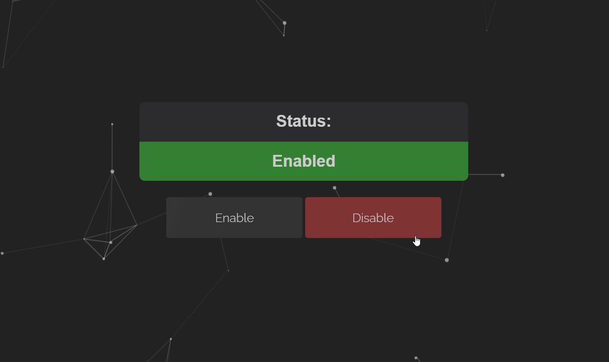

# dark-flask

A dark theme Flask project

## About

This is a very simple flask application that includes a page with buttons, tied in JS, particleJS, and a dark-theme.

## Usage

```text
docker-compose up --build -d
```

Then browse to:

- `localhost/button`
- `localhost/basic`

## Example


